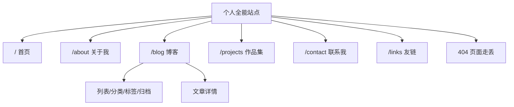
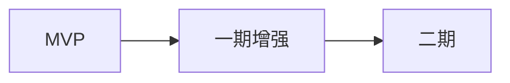

# 个人全能站点 — 产品需求文档（PRD）

## 1. 文档信息

| 项目 | 说明 |
|------|------|
| 产品名称 | 个人全能站点 |
| 文档版本 | v1.0 |
| 更新日期 | 2026-06-01 |
| 文档状态 | 初稿 |
| 关联文档 | [技术方案.md](./技术方案.md) |

**文档分工**

- 本文档（PRD）：定义产品做什么、为谁做、验收标准。
- [技术方案.md](./技术方案.md)：定义怎么做、架构选型、实现细节与部署。

---

## 2. 产品概述

### 2.1 产品定位

个人全能站点是面向互联网访客的个人品牌与内容展示平台，集个人简介、技术博客、作品集、联系方式与友链于一体。站点采用「主基座 + 独立业务模块」的轻量微前端形态：Next.js 负责全局外壳与路由，各业务页面以 Web Components 独立交付，NestJS 提供统一数据接口。

### 2.2 核心价值

| 价值维度 | 说明 |
|----------|------|
| 个人展示 | 集中呈现身份、技能与履历，便于合作方快速了解 |
| 内容沉淀 | 博客支持 Markdown、分类与归档，形成可检索的技术输出 |
| 作品证明 | 作品集展示项目与技术栈，并提供源码与在线预览入口 |
| 轻量互动 | 留言与友链支持访客联系与生态互联 |
| 可持续迭代 | 各业务模块可独立构建、部署与升级，不影响全站外壳 |

### 2.3 产品边界

- **包含**：访客侧六类页面、全站导航与搜索、暗黑模式、留言提交、友链浏览。
- **不包含（本期）**：多用户后台管理 UI、评论系统、站内私信、多语言（除中文主文案外）。

---

## 3. 目标用户与场景

### 3.1 目标用户

| 用户类型 | 特征 | 核心诉求 |
|----------|------|----------|
| 技术访客 | 开发者、同行 | 阅读博客、查看项目与技术栈 |
| 潜在合作方 | HR、客户、协作者 | 了解履历、能力边界、联系方式 |
| 友站站长 | 博客圈同行 | 通过友链互访、建立链接 |
| 站点所有者 | 本人 | 通过 API/数据库维护内容（管理端沿用 Nest CRUD，无独立 Admin UI 为 MVP 范围） |

### 3.2 典型场景

| 编号 | 场景 | 用户行为 | 期望结果 |
|------|------|----------|----------|
| S1 | 首次访问 | 打开首页 | 快速了解身份、看到精选文章与项目 |
| S2 | 深度阅读 | 进入博客列表并打开文章 | 流畅阅读 Markdown 正文与代码块 |
| S3 | 评估能力 | 浏览作品集 | 查看项目描述并跳转 GitHub/预览 |
| S4 | 建立联系 | 填写留言表单 | 提交成功并获得明确反馈 |
| S5 | 夜间浏览 | 切换暗黑模式 | 全站与子模块视觉一致 |
| S6 | 快速查找 | 使用全站搜索 | 模糊匹配文章与项目并定位内容 |

---

## 4. 产品目标与成功指标

### 4.1 产品目标

1. 完成六类核心业务页面的可用交付（首页、关于、博客、项目、联系、友链）。
2. 保证主基座与各业务模块在主题、导航、数据上体验一致。
3. 支持业务模块独立发布，不阻塞主站外壳更新。
4. 线上可完成三端部署（Web Components 静态资源、Next 主应用、Nest 后端）。

### 4.2 成功指标（验收参考）

| 指标 | 目标 | 测量方式 |
|------|------|----------|
| 首屏加载 | 进入任意路由时仅加载当前页面对应子模块脚本 | 网络面板仅出现 1 个 WC 脚本请求（不含已缓存） |
| 主题一致性 | 切换暗黑/明亮后，子模块卡片与文字对比度正确 | 人工走查六页面 |
| 留言可达 | 表单校验通过后数据写入后端 | 接口返回成功 + 用户可见成功提示 |
| 搜索可用 | 关键词可命中文章标题/摘要或项目名 | 输入已知标题片段可出结果 |
| 模块独立迭代 | 仅更新 wc-blog 构建产物，博客页表现更新 | 主基座无需重新发布即可生效（脚本 URL 不变前提下替换 CDN 文件） |

---

## 5. 信息架构与路由

### 5.1 站点地图

### 5.2 路由与模块映射

| 路由路径 | 页面名称 | Web Component 标签 | 主基座职责 |
|----------|----------|-------------------|------------|
| `/` | 首页 | `<wc-home>` | 懒加载脚本、透传 `theme` |
| `/about` | 关于我 | `<wc-about>` | 同上 |
| `/blog` | 博客 | `<wc-blog>` | 同上；详情路由见 7.3 |
| `/projects` | 作品集 | `<wc-projects>` | 同上 |
| `/contact` | 联系我 | `<wc-contact>` | 同上；监听子组件事件 |
| `/links` | 友链 | `<wc-links>` | 同上 |
| 未匹配路径 | 404 | — | Next 内置 `not-found` 页 |

### 5.3 全局导航结构

顶栏固定入口：首页、关于我、博客、项目、联系我、友链；右侧：GitHub 外链图标、暗黑模式切换。页脚展示版权与站点技术说明。

---

## 6. 全局能力（主基座）

主基座由 Next.js 14 App Router 实现，不向访客暴露技术细节，对外表现为统一站点外壳。

### 6.1 功能清单

| 编号 | 功能 | 描述 |
|------|------|------|
| G1 | 全局布局 | 顶栏、主内容区、页脚；主内容区最大宽度与留白一致 |
| G2 | 路由分发 | App Router 映射至六条业务路由 |
| G3 | 导航高亮 | 当前路由对应导航项可识别（样式区分） |
| G4 | GitHub 外链 | 点击在新标签打开个人 GitHub，带 `noopener noreferrer` |
| G5 | 暗黑模式 | 支持 system / light / dark；手动切换按钮 |
| G6 | 主题透传 | 将当前 `theme` 作为属性传给已挂载的子组件 |
| G7 | 子模块按需加载 | 路由进入时动态加载对应 WC 脚本；展示加载中状态 |
| G8 | 脚本去重 | 同一路由重复进入不重复插入 script |
| G9 | 全站搜索 | 聚合文章与项目数据，fuse.js 模糊搜索（入口位于顶栏或约定位置） |
| G10 | 404 页面 | 文案「页面走丢了」+ 返回首页链接 |
| G11 | 子组件事件监听 | 在联系页等场景监听 CustomEvent（如留言成功） |

### 6.2 用户故事

- **作为访客**，我希望在任何页面看到一致的导航和页脚，以便快速跳转到其他栏目。
- **作为访客**，我希望切换暗黑模式后整站包括内容区卡片都随之变化，以便夜间阅读舒适。
- **作为访客**，我希望切换页面时看到加载提示而不是空白，以便知晓内容正在载入。

### 6.3 验收标准

| 编号 | Given | When | Then |
|------|-------|------|------|
| G-A1 | 用户打开任意合法路由 | 页面开始渲染 | 先出现加载中提示，脚本加载完成后展示对应 `<wc-*>` |
| G-A2 | 用户点击暗黑切换 | 主题变更 | 主基座背景/文字变化，且子组件 `theme` 属性同步更新 |
| G-A3 | 用户访问不存在路径 | 路由未匹配 | 展示 404 页，点击「返回首页」进入 `/` |
| G-A4 | 用户在同一页面刷新两次 | 脚本已加载过 | 不重复插入相同 `src` 的 script 标签 |
| G-A5 | 用户在搜索框输入已知文章标题关键词 | 确认搜索 | 结果列表包含该文章，点击可进入对应内容（列表或详情策略与 7.3 一致） |

---

## 7. 功能需求（按模块）

各业务模块以 Web Components 交付，标签名统一为 `wc-*`。以下采用统一模板：**用户故事 → 功能列表 → 验收标准 → 依赖接口**。

---

### 7.1 首页 `<wc-home>`

**用户故事**

- 作为首次访客，我希望在首页看到简短自我介绍和精选内容，以便在 30 秒内判断是否继续浏览。

**功能列表**

| 编号 | 功能 | 优先级 |
|------|------|--------|
| H1 | 个人简介区 | 展示标题、一句话定位、技术栈说明（文案可配置） | P0 |
| H2 | 精选博客 | 从文章列表取前 3 条展示标题与摘要 | P0 |
| H3 | 精选项目 | 从项目列表取前 3 条展示名称、描述、技术栈 | P0 |
| H4 | 暗黑适配 | 根据 `theme` 属性切换卡片边框与背景 | P0 |
| H5 | 接口降级 | 请求失败时展示友好提示，不白屏崩溃 | P1 |

**验收标准**

- [ ] 进入 `/` 后展示简介区与两个「精选」区块。
- [ ] 后端正常时，博客与项目各至多 3 条；不足 3 条时按实际数量展示。
- [ ] 后端不可用时，区块显示错误提示或空状态文案，页面其余结构仍可见。
- [ ] 切换暗黑模式后，卡片边框色与文字对比度与主基座风格一致。

**依赖接口**

- `GET /api/article/list`
- `GET /api/project/list`

---

### 7.2 关于我 `<wc-about>`

**用户故事**

- 作为潜在合作方，我希望查看自我介绍、技能标签和履历，以便评估是否匹配合作需求。

**功能列表**

| 编号 | 功能 | 优先级 |
|------|------|--------|
| A1 | 自我介绍 | 多段个人说明文字 | P0 |
| A2 | 技能展示 | 技能名称列表或标签云 | P0 |
| A3 | 履历时间线 | 工作/教育经历：机构、角色、时间段、简述 | P0 |
| A4 | 暗黑适配 | 随 `theme` 切换排版与颜色 | P0 |

**内容来源（MVP 决策）**

- **首期**：关于页内容可采用组件内静态配置或单一配置接口；不阻塞全站上线。
- **后续**：可扩展为 `GET /api/profile` 等专用接口，PRD 不强制 MVP 实现。

**验收标准**

- [ ] 进入 `/about` 可看到自我介绍、技能、履历三个信息区块。
- [ ] 履历按时间倒序或产品约定顺序展示，单条缺失字段不导致布局错乱。
- [ ] 暗黑模式下文字可读，链接（若有）可辨认。

**依赖接口**

- MVP：无强制接口；可选扩展 profile 类接口。

---

### 7.3 博客 `<wc-blog>`

**用户故事**

- 作为技术访客，我希望按列表浏览文章、按分类/标签筛选，并阅读排版良好的 Markdown 正文。
- 作为访客，我希望通过清晰 URL 分享某一篇文章。

**功能列表**

| 编号 | 功能 | 优先级 |
|------|------|--------|
| B1 | 文章列表 | 标题、摘要、发布时间；支持分页 | P0 |
| B2 | 文章详情 | Markdown 渲染；代码块语法高亮 | P0 |
| B3 | 分类筛选 | 按分类过滤列表 | P1 |
| B4 | 标签筛选 | 按标签过滤列表 | P1 |
| B5 | 归档视图 | 按年月归档浏览 | P1 |
| B6 | 暗黑适配 | 正文与代码块在暗色下可读 | P0 |

**路由协同（产品约定）**

- **推荐**：由 Next 主基座提供 `/blog`（列表）与 `/blog/[slug]` 或 `/blog/[id]`（详情）；详情页同样挂载 `<wc-blog>`，通过属性（如 `article-id`、`mode="detail"`）或路径属性告知子组件当前模式。
- **备选**：组件内 hash 路由（`#/post/xxx`），需在验收中单独注明；默认采用 Next 子路由方案以利于 SEO 与分享。

**验收标准**

- [ ] 列表页展示至少 1 篇文章时，卡片含标题、摘要、日期。
- [ ] 分页：数据量超过单页大小时，可翻页且页码/加载更多行为符合设计。
- [ ] 详情页：正文 Markdown 标题、列表、代码块渲染正确；代码块有语法高亮。
- [ ] 分类/标签/归档（P1）：选择筛选项后列表仅显示符合条件文章。
- [ ] 从列表进入详情再返回，列表状态合理（可接受重新加载）。

**依赖接口**

- `GET /api/article/list`（含筛选 query，与技术方案实现对齐）
- `GET /api/article/:id` 或等价详情接口

---

### 7.4 作品集 `<wc-projects>`

**用户故事**

- 作为访客，我希望浏览项目卡片并一键打开 GitHub 或在线演示，以便验证作品真实性。

**功能列表**

| 编号 | 功能 | 优先级 |
|------|------|--------|
| P1 | 项目列表 | 卡片展示名称、描述、技术栈 | P0 |
| P2 | GitHub 链接 | 有 URL 时展示「源码」类按钮/链接 | P0 |
| P3 | 在线预览 | 有 previewUrl 时展示「预览」链接 | P0 |
| P4 | 外链安全 | 新标签打开 + `noopener noreferrer` | P0 |
| P5 | 暗黑适配 | 卡片在暗色主题下可读 | P0 |

**验收标准**

- [ ] 进入 `/projects` 展示全部项目卡片（或分页，与后端约定一致）。
- [ ] 某项目无 `githubUrl` 时，不显示源码按钮或显示为禁用态，布局不塌陷。
- [ ] 某项目无 `previewUrl` 时，同上。
- [ ] 点击外链在新标签打开目标地址。

**依赖接口**

- `GET /api/project/list`

---

### 7.5 联系我 `<wc-contact>`

**用户故事**

- 作为访客，我希望看到作者的社交联系方式，并能留言以便后续沟通。
- 作为站点所有者，我希望收到结构化留言数据。

**功能列表**

| 编号 | 功能 | 优先级 |
|------|------|--------|
| C1 | 联系方式展示 | 邮箱、微信、Twitter 等（字段可配置） | P0 |
| C2 | 留言表单 | 昵称、联系方式（选填）、内容 | P0 |
| C3 | 前端校验 | 必填项、长度、格式（邮箱等） | P0 |
| C4 | 提交反馈 | 成功/失败态文案或样式 | P0 |
| C5 | 事件通知 | 成功后向主应用派发 `message-success` | P0 |
| C6 | 暗黑适配 | 表单与说明在暗色下可用 | P0 |

**验收标准**

- [ ] 未填必填项时提交被阻止，并提示具体字段。
- [ ] 提交成功：表单展示成功态；主应用可收到 `message-success` 并展示 Toast/Alert（实现方式不限）。
- [ ] 提交失败（网络或 4xx/5xx）：展示失败提示，不丢失用户已填内容（可选清除策略需在 UI 说明）。
- [ ] 联系方式外链符合 G4 安全规范。

**依赖接口**

- `POST /api/message` 或等价留言创建接口

---

### 7.6 友链 `<wc-links>`

**用户故事**

- 作为友站站长或访客，我希望看到友情链接列表并点击访问对方站点。

**功能列表**

| 编号 | 功能 | 优先级 |
|------|------|--------|
| L1 | 友链列表 | 名称、链接、可选描述/头像 | P0 |
| L2 | 排序 | 按后台 sort 字段或约定顺序展示 | P1 |
| L3 | 外链安全 | 新标签 + `noopener noreferrer` | P0 |
| L4 | 暗黑适配 | 列表在暗色下可读 | P0 |

**验收标准**

- [ ] 进入 `/links` 展示全部友链；空列表时展示空状态文案。
- [ ] 每条友链可点击跳转；图标/头像加载失败时不破坏行高。
- [ ] 外链安全属性符合规范。

**依赖接口**

- `GET /api/link/list` 或等价友链接口

---

### 7.7 全站搜索（主基座 G9 细化）

**用户故事**

- 作为回访访客，我希望用关键词快速找到相关文章或项目。

**功能列表**

| 编号 | 功能 | 优先级 |
|------|------|--------|
| S1 | 数据聚合 | 启动或首次搜索前拉取文章+项目用于索引 | P1 |
| S2 | 模糊匹配 | 对标题、摘要、描述等字段 fuse 搜索 | P1 |
| S3 | 结果展示 | 区分类型（文章/项目），可点击跳转 | P1 |
| S4 | 空结果 | 无匹配时提示 | P1 |

**验收标准**

- [ ] 输入存在的文章标题片段，结果中出现该文章。
- [ ] 输入存在的项目名称片段，结果中出现该项目。
- [ ] 无匹配时展示「无结果」类提示，不报错崩溃。

**依赖接口**

- `GET /api/article/list`
- `GET /api/project/list`

---

## 8. 数据与内容模型

后端统一由 NestJS + Prisma + SQLite 提供 REST API（默认端口 3001）。以下为产品级实体定义，不涉及数据库实现细节。

### 8.1 实体：文章（Article）

| 字段 | 类型 | 必填 | 说明 |
|------|------|------|------|
| id | 标识 | 是 | 唯一 ID |
| title | 文本 | 是 | 标题 |
| summary | 文本 | 否 | 摘要，列表展示 |
| content | 长文本 | 是 | Markdown 正文 |
| category | 文本 | 否 | 分类名 |
| tags | 列表 | 否 | 标签集合 |
| publishedAt | 时间 | 是 | 发布时间 |
| slug | 文本 | 否 | URL 友好标识，供详情路由 |

**能力**：列表、详情、按分类/标签/时间归档筛选。

### 8.2 实体：项目（Project）

| 字段 | 类型 | 必填 | 说明 |
|------|------|------|------|
| id | 标识 | 是 | 唯一 ID |
| name | 文本 | 是 | 项目名称 |
| desc | 文本 | 是 | 简短描述 |
| techStack | 文本 | 否 | 技术栈说明 |
| githubUrl | URL | 否 | 源码地址 |
| previewUrl | URL | 否 | 在线预览地址 |

**能力**：列表；首页精选为列表子集。

### 8.3 实体：留言（Message）

| 字段 | 类型 | 必填 | 说明 |
|------|------|------|------|
| id | 标识 | 是 | 唯一 ID |
| nickname | 文本 | 是 | 昵称 |
| contact | 文本 | 否 | 邮箱或其他联系方式 |
| content | 长文本 | 是 | 留言内容 |
| createdAt | 时间 | 是 | 提交时间 |

**能力**：访客创建；所有者通过 API/数据库查看（管理 UI 为二期）。

### 8.4 实体：友链（Link）

| 字段 | 类型 | 必填 | 说明 |
|------|------|------|------|
| id | 标识 | 是 | 唯一 ID |
| name | 文本 | 是 | 站点名称 |
| url | URL | 是 | 跳转地址 |
| description | 文本 | 否 | 简介 |
| avatar | URL | 否 | 头像/图标 |
| sort | 数字 | 否 | 排序权重，越小越靠前 |

**能力**：列表。

---

## 9. 交互与体验规范

### 9.1 加载与反馈

| 场景 | 规范 |
|------|------|
| 子模块脚本加载 | 主内容区居中展示「加载中...」或等价文案 |
| 接口请求中 | 列表区可使用骨架屏或 loading 文案 |
| 表单提交 | 按钮 loading 态，防止重复提交 |
| 表单成功 | 子组件内成功文案 + 主应用可选全局提示 |
| 表单失败 | 明确错误原因（网络/校验/服务端） |

### 9.2 导航与外链

- 站内跳转使用 Next `Link`，无整页刷新闪烁（在实现允许范围内）。
- 站外链接（GitHub、友链、项目预览）统一新标签打开，并设置 `rel="noopener noreferrer"`。

### 9.3 暗黑模式

- 主基座：`next-themes`，支持跟随系统。
- 子模块：通过 `theme` 属性（`light` / `dark`）驱动 Shadow DOM 内样式。
- 切换主题时，已挂载组件无需 remount，属性更新即可同步。

### 9.4 主应用与子组件通信（产品级）

| 方向 | 机制 | 示例 |
|------|------|------|
| 主 → 子 | HTML 属性 | `theme`、`api-base`、`article-id` |
| 子 → 主 | CustomEvent | `message-success`（`bubbles` + `composed`） |

详见 [附录 B：事件契约](#附录-b-主应用与子组件事件契约)。

### 9.5 可访问性基线

- 正文与背景对比度在明暗两种主题下均可阅读。
- 表单控件有关联 label 或 `aria-label`。
- 图标按钮（如暗黑切换、GitHub）具备可访问名称。

---

## 10. 非功能需求

### 10.1 性能

| 编号 | 要求 |
|------|------|
| NF-P1 | 首屏仅加载当前路由对应 Web Component 脚本 |
| NF-P2 | 同一脚本 URL 不重复插入 DOM |
| NF-P3 | 子模块样式与脚本体积保持单页合理范围（单组件构建产物宜可控，具体阈值在技术方案中约定） |

### 10.2 可维护性与扩展

| 编号 | 要求 |
|------|------|
| NF-M1 | 各 `wc-*` 可独立仓库/目录、独立 CI、独立部署 |
| NF-M2 | 新增页面时，仅需新增 Web Component + Next 路由页，无需改动其他子模块 |
| NF-M3 | 后端接口变更需版本化或文档同步至附录 A |

### 10.3 安全

| 编号 | 要求 |
|------|------|
| NF-S1 | 生产环境全站 HTTPS |
| NF-S2 | 后端配置 CORS，仅允许前端正式域名 |
| NF-S3 | 留言接口需基础防刷（频率限制或验证码为二期可选） |
| NF-S4 | 用户输入展示时防 XSS（Markdown 渲染需安全策略） |

### 10.4 兼容性

| 编号 | 要求 |
|------|------|
| NF-C1 | 使用自定义元素的页面必须为客户端渲染，避免 SSR 未知标签告警 |
| NF-C2 | 目标浏览器：现代 Chromium、Safari、Firefox 近两版 |

### 10.5 样式隔离

| 编号 | 要求 |
|------|------|
| NF-I1 | 子模块使用 Shadow DOM，样式不污染主基座与其他子模块 |
| NF-I2 | 全局主题可通过 CSS 变量或 `theme` 属性协商扩展 |

---

## 11. 版本规划

### 11.1 MVP（必须交付）

| 范围 | 内容 |
|------|------|
| 页面 | 六类业务页 + 404 |
| 主基座 | 导航、Footer、GitHub、暗黑、按需加载、主题透传 |
| 首页 | 简介 + 精选博客/项目 |
| 关于 | 静态或配置化内容 |
| 博客 | 列表 + 详情 + Markdown + 代码高亮 |
| 项目 | 列表 + 外链 |
| 联系 | 表单 + 提交 + 事件反馈 |
| 友链 | 列表 |
| 后端 | 文章/项目/留言/友链 CRUD API 可用 |

### 11.2 一期增强

- 博客：分类、标签、归档筛选完整交互。
- 关于页：后端 profile 接口驱动。
- 全站搜索：入口 UI 完善、结果高亮、键盘导航。

### 11.3 二期

- 内容管理后台 UI（可视化发文、友链管理）。
- 留言防刷、审核流。
- 搜索：搜索结果与子模块深度联动（属性/事件传递）。
- 可选：RSS、站点统计、评论系统。

### 11.4 实施顺序（与技术方案对齐）

1. 启动并验证 Nest 后端 API。
2. 按模板完成六个 Web Component 开发与联调端口。
3. Next 主基座嵌入、主题与事件打通。
4. 三端分别部署并替换生产环境脚本与 API 地址。

---

## 12. 范围外与风险

### 12.1 明确不在范围

| 项 | 说明 |
|----|------|
| Module Federation | 已废弃，不纳入本期与规划 |
| 原生 Web Components（无 Lit） | 仅作技术备选，不作为 MVP 交付标准 |
| 多租户 / 多作者 | 单作者个人站 |
| 移动端独立 App | 仅响应式 Web |

### 12.2 风险与缓解

| 风险 | 影响 | 缓解措施 |
|------|------|----------|
| 子模块脚本 CDN 不可用 | 页面空白 | 加载失败提示 + 监控；主基座 fallback 文案 |
| 跨域 / CORS 配置错误 | 接口全部失败 | 部署检查清单；开发/生产 `api-base` 分离 |
| 暗黑不同步 | 体验割裂 | 主基座 `theme` 变更必须同步到属性 |
| 事件无法冒泡 | 留言成功无全局提示 | 子组件事件必须 `bubbles` + `composed` |
| Markdown XSS | 安全漏洞 | 使用安全渲染库并过滤危险标签 |

---

## 13. 附录

### 附录 A：API 资源一览

基础路径：`{API_BASE}`，默认开发环境 `http://localhost:3001/api`。生产环境由部署配置注入，可通过 `api-base` 属性下发给子组件。

| 方法 | 路径（示例） | 说明 | 使用模块 |
|------|--------------|------|----------|
| GET | `/article/list` | 文章列表，支持筛选 query | wc-home, wc-blog, 搜索 |
| GET | `/article/:id` | 文章详情 | wc-blog |
| GET | `/project/list` | 项目列表 | wc-home, wc-projects, 搜索 |
| POST | `/message` | 创建留言 | wc-contact |
| GET | `/link/list` | 友链列表 | wc-links |

> 具体 query 参数、响应字段以 [技术方案.md](./技术方案.md) 及 nest-server 实现为准；接口变更须同步更新本表。

### 附录 B：主应用与子组件事件契约

| 事件名 | 派发方 | 监听方 | detail 示例 | 必选配置 |
|--------|--------|--------|-------------|----------|
| `message-success` | `wc-contact` | Next `/contact` 页 | `{ msg: '留言提交成功' }` | `bubbles: true`, `composed: true` |

**属性契约（常用）**

| 属性名 | 类型 | 提供方 | 说明 |
|--------|------|--------|------|
| `theme` | `light` \| `dark` | Next 各路由页 | 与子模块暗黑样式同步 |
| `api-base` | string | Next（可选） | 覆盖默认 API 根路径 |
| `article-id` | string | Next `/blog/[id]`（可选） | 详情模式标识 |

### 附录 C：环境与联调参考

开发期各子模块 Vite dev 端口（与技术方案一致，**可配置**）：

| 组件 | 默认端口 | 脚本产物示例 |
|------|----------|--------------|
| wc-home | 4001 | `wc-home.es.js` |
| wc-about | 4002 | `wc-about.es.js` |
| wc-blog | 4003 | `wc-blog.es.js` |
| wc-projects | 4004 | `wc-projects.es.js` |
| wc-contact | 4005 | `wc-contact.es.js` |
| wc-links | 4006 | `wc-links.es.js` |

Next 主基座默认：`http://localhost:3000`。  
Nest 后端默认：`http://localhost:3001`。

生产环境：Web Components 静态资源部署至 CDN/Pages；Next 部署 Vercel 等；Nest 部署 Render/Railway/云主机；Next 内脚本 URL 与 `api-base` 替换为线上地址。

### 附录 D：需求追溯矩阵（MVP）

| PRD 编号 | 技术方案章节 |
|----------|--------------|
| G1–G11 | 四、六、十 |
| H1–H5 | 三（wc-home）、六 |
| A1–A4 | 三（wc-about） |
| B1–B6 | 六（wc-blog） |
| P1–P5（项目模块） | 三、六（wc-projects） |
| C1–C6 | 五、六（wc-contact） |
| L1–L4 | 三（wc-links） |
| NF-* | 一、三、八、十 |
| 部署 | 八 |

---

## 修订记录

| 版本 | 日期 | 修订人 | 说明 |
|------|------|--------|------|
| v1.0 | 2026-06-01 | — | 依据技术方案初稿生成 |
